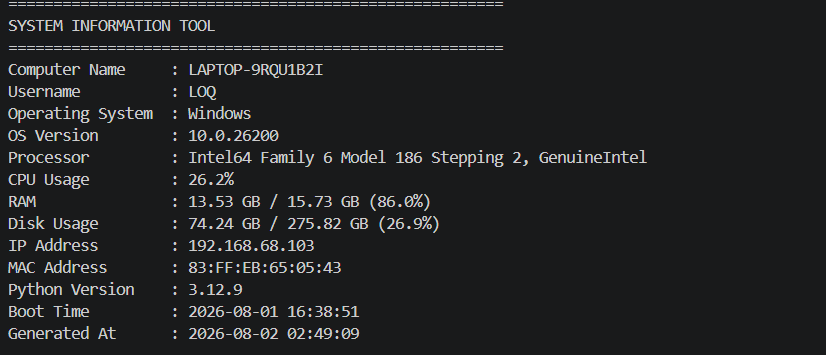
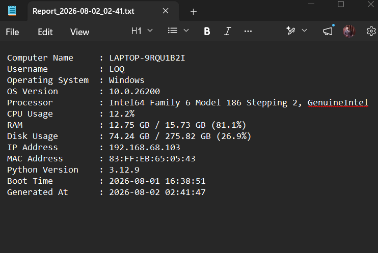
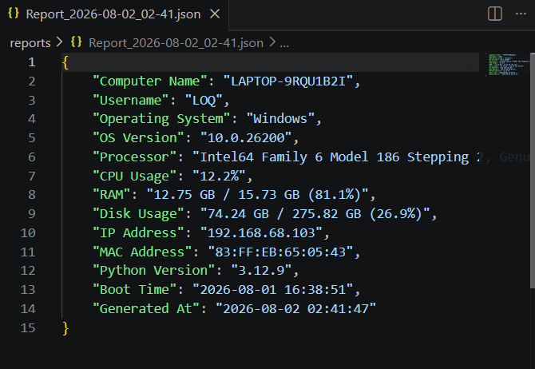
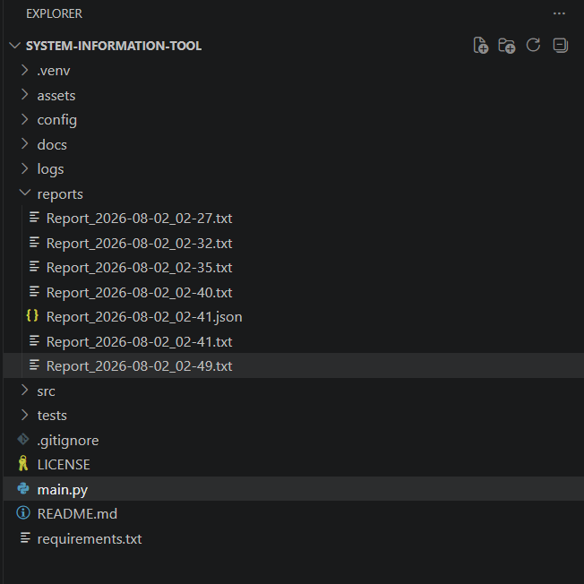

# 🖥️ System Information Tool

A professional Python application that collects detailed system information and generates reports in TXT and JSON formats. The project follows clean code principles, modular architecture, and Python best practices.

---

## 🚀 Features

- Display computer name
- Display current username
- Display operating system and version
- Display processor information
- Display CPU usage
- Display RAM usage
- Display disk usage
- Display IP address
- Display MAC address
- Display Python version
- Display system boot time
- Generate TXT reports
- Generate JSON reports (`--json`)
- Application logging
- Organized project structure

---

## 🛠️ Technologies Used

- Python 3.12+
- psutil
- pathlib
- logging
- argparse
- json
- socket
- platform
- uuid

---

## 📂 Project Structure

```
System-Information-Tool/
│
├── assets/
├── logs/
│   └── system_information.log
├── reports/
│   ├── Report_YYYY-MM-DD_HH-MM.txt
│   └── Report_YYYY-MM-DD_HH-MM.json
├── src/
│   ├── logger.py
│   ├── report.py
│   └── system_info.py
├── main.py
├── requirements.txt
├── README.md
└── LICENSE
```

---

## ⚙️ Installation

Clone the repository:

```bash
git clone https://github.com/sadeemd/system-information-tool.git
```

Navigate to the project:

```bash
cd system-information-tool
```

Create a virtual environment:

```bash
python -m venv .venv
```

Activate the virtual environment:

### Windows PowerShell

```powershell
.venv\Scripts\Activate.ps1
```

Install dependencies:

```bash
pip install -r requirements.txt
```

---

## ▶️ Usage

Run the application:

```bash
python main.py
```

Generate TXT + JSON reports:

```bash
python main.py --json
```

---

## 📄 Example Output

```
=======================================================
SYSTEM INFORMATION TOOL
=======================================================

Computer Name : DESKTOP-XXXX
Username      : User
Operating Sys : Windows
OS Version    : 11
Processor     : Intel(R) Core(TM)
CPU Usage     : 12%
RAM           : 9.3 GB / 16 GB
Disk Usage    : 210 GB / 512 GB
IP Address    : 192.168.1.5
MAC Address   : XX:XX:XX:XX:XX:XX
Python Version: 3.12
Boot Time     : 2026-08-02 08:15:32
```

---

## Screenshots

### Main Window



### TXT Report



### JSON Report



### Logs


### Project Structure



---

## 📋 Future Improvements

- Export reports as PDF
- Export reports as Excel
- Colorized terminal output
- Hardware information
- Network adapter details
- Email report feature
- Scheduled automatic reports
- GUI version using CustomTkinter

---

## 📜 License

This project is licensed under the MIT License.

---

## 👨‍💻 Author

**Sadeem Dheyaa**

- LinkedIn: https://www.linkedin.com/in/sadeem-dheyaa-209b36124/
- GitHub: https://github.com/sadeemd