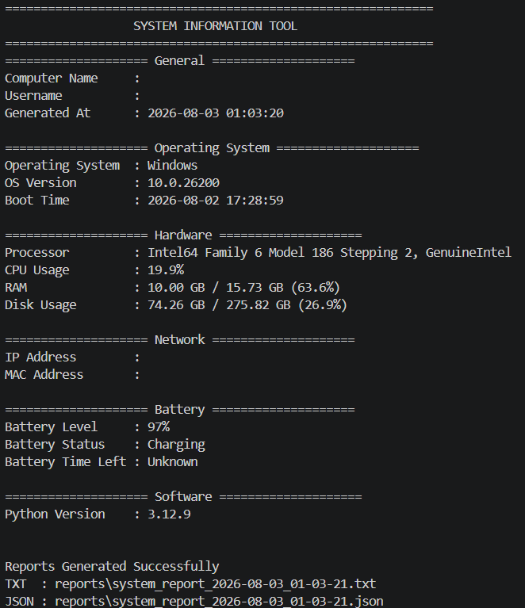

# 🖥️ System Information Tool

A professional Python application that collects detailed system information and generates well-formatted TXT and JSON reports. The project follows clean code principles, modular architecture, and Python best practices.

---

## 🚀 Features

- Display general system information
- Display operating system details
- Display processor information
- Display CPU usage
- Display RAM usage
- Display disk usage
- Display IP address
- Display MAC address
- Display battery information
- Display Python version
- Display system boot time
- Generate formatted TXT reports
- Generate JSON reports
- Application logging
- Clean project architecture
- Cross-platform file handling using `pathlib`
- Modular output formatter
- Unit testing with `pytest`

---

## 🛠️ Technologies Used

- Python 3.12+
- psutil
- pathlib
- logging
- pytest
- json
- socket
- platform
- uuid

---

## 📂 Project Structure

```text
System-Information-Tool/
│
├── assets/
├── logs/
│   └── system_information.log
├── reports/
│   ├── system_report_YYYY-MM-DD_HH-MM-SS.txt
│   └── system_report_YYYY-MM-DD_HH-MM-SS.json
├── src/
│   ├── formatter.py
│   ├── logger.py
│   ├── report.py
│   └── system_info.py
├── tests/
│   ├── conftest.py
│   └── test_system_info.py
├── main.py
├── requirements.txt
├── README.md
└── LICENSE
```

---

## ⚙️ Installation

Clone the repository:

```bash
git clone https://github.com/sadeemd/system-information-tool.git
```

Navigate to the project:

```bash
cd system-information-tool
```

Create a virtual environment:

```bash
python -m venv .venv
```

Activate it (Windows PowerShell):

```powershell
.venv\Scripts\Activate.ps1
```

Install the dependencies:

```bash
pip install -r requirements.txt
```

---

## ▶️ Usage

Run the application:

```bash
python main.py
```

The application automatically generates both TXT and JSON reports inside the `reports` folder.

---

## 📄 Example Output

```text
============================================================
                  SYSTEM INFORMATION TOOL
============================================================

==================== General ====================
Computer Name     : LAPTOP-XXXX
Username          : User

==================== Operating System ====================
Operating System  : Windows
OS Version        : 11

==================== Hardware ====================
Processor         : Intel(R) Core(TM)
CPU Usage         : 12%
RAM               : 9.3 GB / 16 GB
Disk Usage        : 210 GB / 512 GB

==================== Network ====================
IP Address        : 192.168.1.5
MAC Address       : XX:XX:XX:XX:XX:XX

==================== Battery ====================
Battery Level     : 97%
Battery Status    : Charging
Battery Time Left : Unknown

==================== Software ====================
Python Version    : 3.12
```

---

## 📷 Screenshots

### Terminal Output



### TXT Report


### JSON Report


### Logs


### Project Structure


---

## 🧪 Running Tests

Run all tests using:

```bash
pytest
```

---

## 📋 Future Improvements

- Export reports as PDF
- Export reports as Excel
- Display detailed network adapter information
- Display GPU information
- Colorized terminal output
- Email report feature
- Scheduled automatic reports
- GUI version using CustomTkinter

---

## 📜 License

This project is licensed under the MIT License.

---

## 👨‍💻 Author

**Sadeem Dheyaa**

- LinkedIn: https://www.linkedin.com/in/sadeem-dheyaa-209b36124/
- GitHub: https://github.com/sadeemd